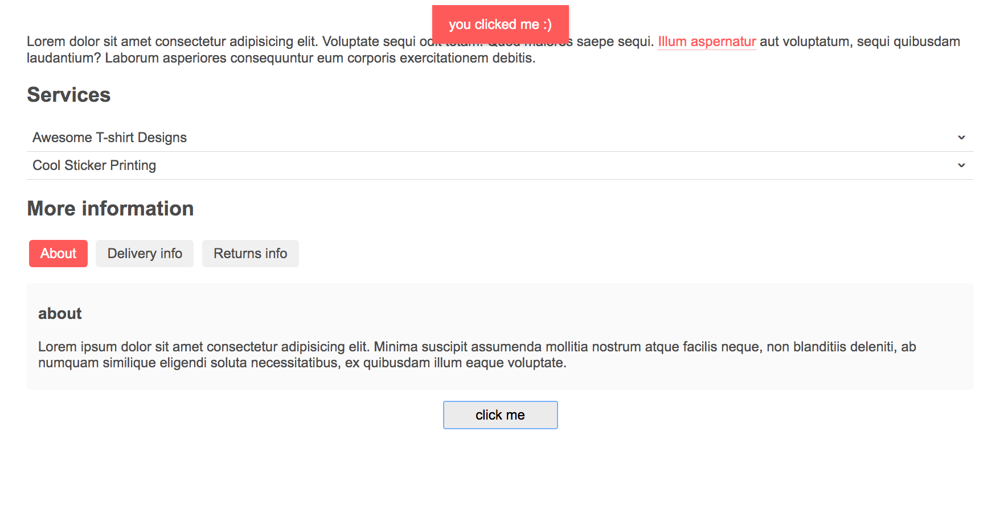

# UI-Library
Small UI Library (practicing ES6 with Webpack and Babel)

Built ui library with different features, for example:

  - tooltips
  - dropdowns
  - tapped content
  - toast (little notification at the top)
 
 
 
 

